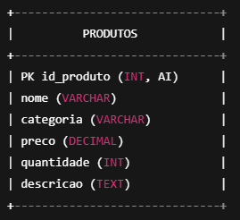

# 🏪 Sistema de Gerenciamento de Produtos  
Aplicação em PHP para cadastro, alteração, exclusão, consulta e listagem de produtos de uma loja.  
O sistema utiliza **PDO com MySQL**, interface simples em abas (Tabs) e funcionalidade completa de CRUD.

---

## 🚀 Funcionalidades

- ✔ **Cadastrar** novos produtos  
- ✔ **Alterar** produtos existentes  
- ✔ **Excluir** produtos do banco  
- ✔ **Consultar** dados de um produto específico  
- ✔ **Listar** todos os produtos cadastrados  
- ✔ Interface feita em HTML + CSS + JavaScript (abas dinâmicas)

---

## 🛠 Tecnologias Utilizadas

- **PHP** (PDO)
- **MySQL**
- **HTML5**
- **CSS3**
- **JavaScript**
- **XAMPP** (recomendado)

---

## 📂 Estrutura da Tabela no Banco de Dados

Crie o banco chamado **loja_recuperacao** e execute:

```sql
CREATE TABLE produtos (
    id_produto INT AUTO_INCREMENT PRIMARY KEY,
    nome VARCHAR(255) NOT NULL,
    categoria VARCHAR(100) NOT NULL,
    preco DECIMAL(10,2) NOT NULL,
    quantidade INT NOT NULL,
    descricao TEXT
);
```
🖥 Como Rodar o Projeto
Instale e abra o XAMPP.

Inicie Apache e MySQL.

No phpMyAdmin, crie o banco:

nginx
Copiar código
loja_recuperacao
Crie a tabela usando o SQL acima.

Coloque o arquivo do sistema dentro da pasta:

bash
Copiar código
htdocs/loja/
Acesse no navegador:

arduino
Copiar código
http://localhost/loja
📌 Como Usar

A interface possui abas:

🔹 Cadastrar

Preencha o formulário com nome, categoria, preço, quantidade e descrição.

🔹 Alterar

Selecione um produto no menu e os dados serão carregados automaticamente.

🔹 Excluir

Mostra os dados do item selecionado e permite remover.

🔹 Consultar

Exibe os detalhes sem permitir alterações.

🔹 Listar

Mostra uma tabela com todos os produtos cadastrados.

📦 Arquivo Principal

Todo o sistema funciona em um único arquivo PHP que:

Conecta ao banco com PDO

Gerencia ações via POST

Atualiza registros

Exibe abas e formulários

📌 Modelo Lógico DER


📸 Screenshots 


🧑‍💻 Autor

Projeto desenvolvido por Pedro.
